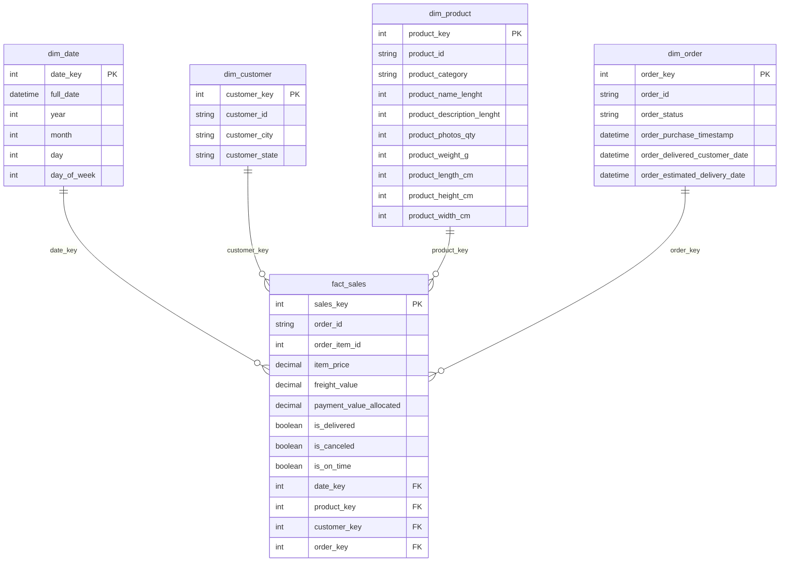
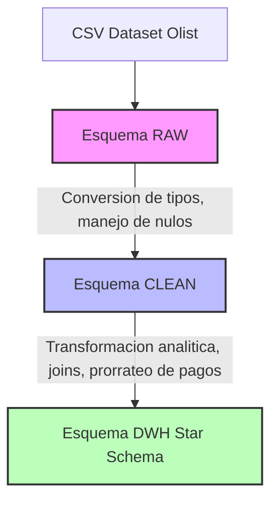

# Dashboard de Ventas Olist - Prueba Técnica Full-Stack

Este proyecto implementa un dashboard analítico sobre el dataset público de Olist.

## 🚀 Cómo Ejecutar

### Requisitos

- Docker y Docker Compose instalados.

### Pasos

1. Clonar el repositorio.
2. Copiar `.env.example` a `.env`.
3. Ejecutar `docker-compose up --build`.
4. Acceder al frontend en `http://localhost:3000` y al backend en `http://localhost:3001/health`.

El comando `up` se encargará de:

- Levantar la base de datos PostgreSQL.
- Ejecutar las migraciones de Prisma para crear los esquemas `raw`, `clean` y `dwh`.
- Ejecutar el script de ETL que descarga los CSVs (si no están) y los carga en `raw`, luego los transforma a `clean` y finalmente construye el esquema estrella en `dwh`.
- Iniciar el servidor backend y frontend.

---

## 🏛️ Arquitectura

### Backend (Node.js + Express + TypeScript)

El backend sigue una **Arquitectura Hexagonal (Puertos y Adaptadores)** que separa claramente la lógica de negocio de los detalles de infraestructura:

- **`src/domain`**: Entidades de negocio y contratos de repositorios.
- **`src/application`**: Casos de uso que orquestan el flujo de datos.
- **`src/infrastructure`**: Implementaciones de repositorios con Prisma (solo sobre `dwh`).
- **`src/adapters/http`**: Controladores REST con Express.

**Regla crítica cumplida:** El backend consulta únicamente el esquema `dwh`.

### Frontend (Next.js 16 + TypeScript + TailwindCSS)

- App Router de Next.js.
- Componentes de servidor y cliente.
- Consumo de API vía `fetch`.
- Librerías: Recharts, date-fns, Zod.
- **Recharts**: Librería de gráficos utilizada para la visualización de KPIs y tendencias.
- **date-fns**: Manejo de fechas (parseo, formateo, intervalos).
- **zod**: Validación de esquemas de datos, especialmente en los parámetros de los endpoints.

---

## 📂 Modelo de Datos y ETL

El flujo de datos se divide en tres capas dentro de PostgreSQL: **raw**, **clean** y **dwh** (modelo estrella).

**Script ETL**: `backend/scripts/etl.ts`

1. Lee archivos CSV públicos de Olist (datasets de pedidos).
2. Carga los datos en crudo en el esquema `raw`.
3. Transforma y limpia los datos al esquema `clean` (conversión de tipos, manejo de nulos).
4. Construye el esquema estrella en `dwh` con dimensiones y la tabla de hechos `fact_sales`.

### Tablas cargadas en `raw`

- `raw_orders`
- `raw_order_items`
- `raw_order_payments`
- `raw_products`
- `raw_customers`
- `raw_product_category_name_translation`

### Reglas de limpieza (`clean`)

- Conversión de tipos `TEXT` → `TIMESTAMP`, `DECIMAL`, `INT`.
- Manejo de valores nulos (`NULL` en campos opcionales).
- Normalización de categorías y traducciones.

### Definición del Star Schema (`dwh`)

- **Grano de `fact_sales`**: 1 fila por ítem de orden (`order_id` + `order_item_id`).
- **Dimensiones**:
  - `dim_date` (atributos de fecha).
  - `dim_customer` (ubicación del cliente).
  - `dim_product` (atributos del producto).
  - `dim_order` (estado y fechas de la orden).
- **Asignación de `payment_value`**:
  - Se aplica **prorrateo proporcional** al precio de cada ítem.
  - Fórmula: `(item_price / total_order_price) * total_payment`.

---

## 📊 KPIs Implementados

- **GMV** (Gross Merchandise Value): `SUM(fact_sales.item_price)`  
  Valor total de los productos vendidos (precio de ítems).
- **Revenue** (Ingreso real): `SUM(fact_sales.payment_value_allocated)`  
  Ingreso considerando el pago prorrateado.
- **On-Time Delivery Rate**: `entregas_a_tiempo / total_entregas`  
  Proporción de órdenes entregadas antes o en la fecha estimada.
- **Cancel Rate**: `canceladas / total_órdenes`  
  Porcentaje de órdenes canceladas.
- **Orders Count**: `COUNT(DISTINCT order_id)`  
  Número de órdenes únicas en el período.

---

## 📡 Endpoints del API

| Método | Ruta | Descripción | Parámetros |
|--------|------|-------------|------------|
| `GET` | `/api/kpis` | KPIs generales | `from`, `to`, `order_status?`, `product_category?` |
| `GET` | `/api/trend/revenue` | Tendencia de ingresos | `from`, `to`, `grain`, `order_status?`, `product_category?` |
| `GET` | `/api/rankings/products` | Ranking de productos | `from`, `to`, `metric` (`gmv`|`revenue`), `limit`, `order_status?`, `product_category?` |
| `GET` | `/api/categories` | Lista de categorías | — |
| `GET` | `/api/debug/query-plan` | Plan de consulta (EXPLAIN ANALYZE) | `query` (opcional: `kpis`, `trend`, `rankings`) |

---

## 🧪 Tests

- **Unitarios (mínimo 3)**:
  - Validación de entidades de dominio (`Sale`, `KPI`).
  - Casos de uso (`GetKpisUseCase`, `GetTopProductsUseCase`).
  - Reglas de negocio (ej. prorrateo de pagos).

- **Integración (opcional)**:
  - Test de API `/health` y `/kpis`.

- **Calidad**:
  - Linting con ESLint + Prettier.
  - Manejo consistente de errores HTTP (400, 404, 500).

---

## ⚖️ Decisiones Técnicas y Tradeoffs

- **Prisma vs TypeORM**: Se eligió Prisma porque ofrece tipado fuerte generado automáticamente y mejor soporte para múltiples esquemas PostgreSQL.
- **Prorrateo de pagos**: Se prefirió proporcional al precio de ítem para evitar sesgos en órdenes con múltiples productos.
- **Hexagonal Architecture**: Aísla lógica de negocio de infraestructura, facilitando testeo y mantenibilidad.
- **Docker Compose**: Simplifica la ejecución con servicios aislados (frontend, backend, base de datos).

---

## 📐 Diagrama del Modelo Estrella (simplificado)

```text
                +-------------------+
                |     dim_date      |
                | date_key, year... |
                +---------+---------+
                          |
                          |
+----------------+        |        +------------------+
|  dim_customer  |        |        |   dim_product    |
| customer_key   |        |        | product_key      |
+--------+-------+        |        +---------+--------+
         |                |                  |
         v                v                  v
                +-------------------+
                |    fact_sales     |
                | order_id, item... |
                | metrics, flags    |
                +-------------------+
                          ^
                          |
                +---------+---------+
                |     dim_order     |
                | order_key, status |
                +-------------------+
```

## 📐 Diagrama del Modelo Estrella Visual



## 🔄 Diagrama de Flujo ETL



## Arquitectura Backend(Hexagonal)

flowchart TB
subgraph Domain
D1[Entidades de negocio]
D2[Interfaces (Ports)]
end

    subgraph Application
        A1[Casos de Uso]
    end

    subgraph Infrastructure
        I1[PrismaSalesRepository]
        I2[Conexión a PostgreSQL (DWH)]
    end

    subgraph Adapters
        H1[HTTP Controllers (Express)]
        H2[DTO Validation]
    end

    %% Relaciones
    D1 --> D2
    A1 --> D2
    I1 --> D2
    H1 --> A1
    H2 --> H1